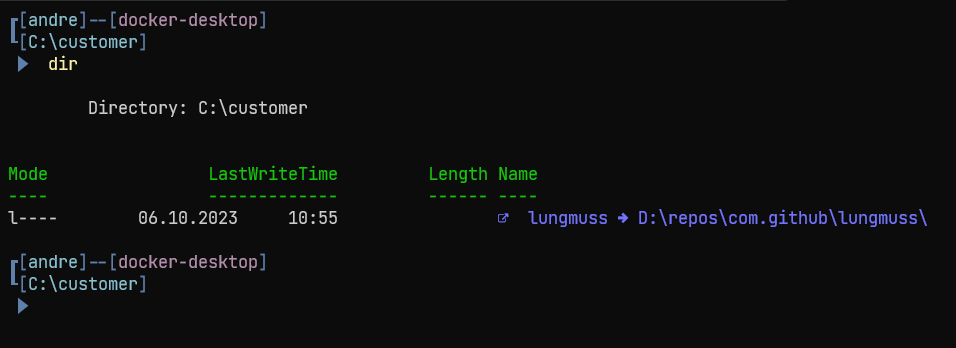

#### Chemikalien-Gesellschaft Hans Lungmuß mbH & Co. KG

Feuerfest seit 1958.
Ihr Spezialist für innovative feuerfeste Produkte.

# Project / Repository Overview

Project ID: `FF-165` (Always use this ID, in addition to the GitHub issue ID, in the commit messages)

Please use [Conventional Commits](https://www.conventionalcommits.org) for commit messages.

# Effective Version Management with GitVersion

As you navigate the often complex landscape of software development, efficient version management is crucial for seamless collaboration and progressive improvement of our project.
Incorporating version information into your commit messages is a powerful strategy, enabling precise tracking and streamlined integration of changes throughout the development pipeline.
Leverage the power of [GitVersion](https://gitversion.net/), which simplifies versioning with automatic and consistent increments while adhering to the Conventional Commits standard.
JetBrains Rider, with its intuitive version control tools, makes managing your GitVersion usage effortless.
This combination fosters a scalable and manageable development environment, boosting productivity and reducing potential errors.
So why not take the step forward and begin integrating version information into your commit messages with declarative GitVersion keywords—streamlining your processes, ensuring clarity, and enhancing the overall efficacy of your project's management.

> The commit message should describe what changes our commit makes to the behavior of the code, not what changed in the code. We can see what changed in the diff with the previous commit, so we don’t need to repeat it in the commit message. But to understand what behavior changed, a commit message can be helpful.<br><br>
> It should answer the question: “What happens if the changes are applied?". If the answer can’t be short, it might be because the commit is not atomic, and it’s too much change in one commit.<sup>[1](https://reflectoring.io/meaningful-commit-messages/#:~:text=The%20commit%20message%20should%20describe,commit%20message%20can%20be%20helpful.)</sup>.

### How to increment the version

You can control version increments through your commit messages by including certain keywords.
These keywords are specified in the `GitVersion.yml` configuration file and follow this format: "+semver: keyword".
Here are the keywords and what they do:

- `+semver: major` or `+semver: breaking`: This will trigger a major version increment.
Use this when you make incompatible API changes.

- `+semver: minor` or `+semver: feature`: This will trigger a minor version increment.
Use this when you add functionality in a backwards compatible manner.

- `+semver: patch` or `+semver: fix`: This will trigger a patch version increment.
Use this when you make backwards compatible bug fixes.

- `+semver: none` or `+semver: skip`: This will prevent the version from being incremented. 
Use this when you make changes that don't affect the project's API, like typo fixes, configuration changes, etc.

Your commit message might look like this: `"+semver: minor Added a new feature for reporting"`

In summary, always be mindful of your commit messages as they directly influence the versioning of your software when using GitVersion.
If no specific version increment is required, omit the "+semver:" part from the commit message, and the versioning tool will follow the default increment strategy.

---

# Setting Up a Common Path for Lungmuß Development Environment

In the Lungmuß development environment, it's imperative that we maintain a consistent and standardized file path structure. The primary reason for this is to ensure that all scripts, tools, and utilities we use can reliably reference and access the necessary repositories without any discrepancies. By having a common path, we eliminate the potential for errors that can arise from individualized or inconsistent directory structures. This not only streamlines our development process but also ensures that our environment remains robust and less prone to path-related issues. 

To set up this common path, we use a PowerShell command to create a junction. A junction is essentially a link or a pointer that redirects requests from one path to another. In our case, it will point from `c:\customer\lungmuss` to your actual repository location. Here's how you can set it up:

```powershell
New-Item -ItemType Junction -Path c:\customer\lungmuss -Target [YOUR_REPOSITORY_PATH]
```

Replace `[YOUR_REPOSITORY_PATH]` with the actual path where you've stored the Lungmuß repository on your hard drive. For instance, if your repository is in `E:\myrepos\lungmuss\`, then you'd replace `[YOUR_REPOSITORY_PATH]` with `E:\myrepos\lungmuss\`.

If, for any reason, you need to delete the junction, you can use the following PowerShell command:

```powershell
Remove-Item -Path c:\customer\lungmuss
```
---

To further streamline our development process and maintain a consistent environment,
we expect all repositories related to Lungmuß projects to be available underneath this common path.
This means that any repository you're working on, whether it's a core module, a utility library,
or any other project associated with Lungmuß, should be accessible via the `c:\customer\lungmuss` junction.
By centralizing our repositories in this manner, we can ensure that scripts, tools,
and other utilities can seamlessly access any repository
without needing to know its actual physical location on your hard drive.
This not only simplifies the process of referencing repositories
but also ensures that our scripts and tools remain agnostic to individual developer machine setups. 

In essence, when you're setting up a new repository or moving an existing one, ensure that it's placed in a location that's accessible through the `c:\customer\lungmuss` junction. This practice will help us maintain a unified development environment and reduce potential path-related issues in the future.

Please ensure that you set up this junction correctly, as it's a foundational aspect of our development environment's structure.

---

# Editing the Windows Hosts File for Keycloak Configuration

The Windows `hosts` file is a system file that maps hostnames to IP addresses. For certain configurations, especially in development environments, it's often necessary to override or specify domain name resolutions locally. In the context of our project, we need to map the hostname `keycloak` to the IP address `127.0.0.1`. This ensures that any requests made to `keycloak` on your machine will be directed to your local machine's IP.

To add this entry to the `hosts` file:

1. Navigate to `C:\Windows\System32\drivers\etc`.
2. Right-click on the `hosts` file and select "Open with".
3. Choose a text editor (like Notepad) with administrative privileges. You might need to right-click on the text editor and select "Run as administrator" before opening the file.
4. At the end of the file, add the following line: `127.0.0.1 keycloak`
5. Save and close the file.

As an alternative to manually editing the `hosts` file, you can use the Windows tool **PowerToys**. PowerToys provides a suite of utilities to enhance the Windows experience, one of which can simplify the process of editing system files like `hosts`. You can download and install PowerToys from its official GitHub repository: [PowerToys](https://github.com/microsoft/PowerToys). Once installed, follow the tool's documentation to edit the `hosts` file.

Please ensure that you make this change carefully, as incorrect entries in the `hosts` file can affect network communications on your machine. If you encounter any issues or need further assistance, don't hesitate to reach out.

---

# Guide to Pulling Images from GitHub Container Registry

If you're looking to pull images from the GitHub Container Registry, you're in the right place. This guide will walk you through the process step by step, making it easy for developers of all levels to get the job done.

## Prerequisites

Before we dive into the process, make sure you have the following:

1. A GitHub account.
2. Docker installed on your system.

## Step 1: Login to GitHub Container Registry

The first thing you need to do is log in to the GitHub Container Registry using your Docker client. Open your terminal and run the following command:

```bash
docker login ghcr.io -u USERNAME
```

Replace `USERNAME` with your GitHub username. After running this command, you'll be prompted for a password.

## Step 2: Use a Personal Access Token (PAT)

Instead of using your GitHub password, you'll need to use a Personal Access Token (PAT) as your password. Here's how to create one:

1. Go to your GitHub account settings.

2. In the left sidebar, click on "Developer settings."

3. Under "Personal access tokens," click on "Generate token."

4. Give your token a name and select the "read:packages" scope.

5. Scroll down and click the "Generate token" button.

6. Copy the generated PAT to your clipboard. Make sure to store it securely, as you won't be able to see it again.

## Step 3: Login with Your PAT

Now, return to your terminal and paste your PAT as the password when prompted during the login process. You won't see the token as you type it, but that's normal. Press Enter after pasting it.

```bash
docker login ghcr.io -u USERNAME
Password: <paste your PAT here>
```

## Step 4: Verify Your Login

After successfully entering your PAT, you should receive a "successful login" message. This means you are now authenticated to pull images from the GitHub Container Registry.

## Troubleshooting (Windows Users)

If you're using Windows and are experiencing issues with the `-p` option for specifying the password (PATH), follow these tips:

- Make sure you've copied the PAT correctly and that there are no extra spaces or characters.
- Ensure you're running the command in a proper shell or terminal.
- If the issue persists, try running the command without the `-p` option, and you'll be prompted to enter the PAT interactively.

## Conclusion

You've successfully logged in to the GitHub Container Registry using your Personal Access Token (PAT). You can now pull images from the registry and use them in your Docker projects with confidence. Happy coding! 🚀

# Guide to Pulling NuGet packages from GitHub

## Creating a Personal Access Token (PAT)

GitHub Packages require authentication. Therefore, you first need to generate a Personal Access Token on GitHub. Here's how to do it:

- Click on your profile picture in the top-right corner and select Settings from the dropdown
- Click on Developer Settings at the bottom left of your settings page
- Open Personal Access Tokens
- Click Generate new token
- Give your token a descriptive name
- Select the necessary scopes. For GitHub Packages, you need repo, read:packages, write:packages, delete:packages
- Generate the token. Be sure to copy the token, as you will not be able to see it again!

## Configure NuGet to use your PAT

Next, you need to tell NuGet how to auth with GitHub Packages.
- Open your NuGet.Config file. This is located at %APPDATA%\NuGet\NuGet.Config on Windows and ~/.config/NuGet/NuGet.Config on Mac/Linux
- Add these lines inside the <configuration> scope:

```
<packageSources>
<add key="github" value="https://nuget.pkg.github.com/lungmuss/index.json" />
</packageSources>

<packageSourceCredentials>
  <github>
    <add key="Username" value="YOUR_GITHUB_USERNAME" />
    <add key="ClearTextPassword" value="YOUR_PAT" />
  </github>
</packageSourceCredentials>
```

## JetBrains Rider NuGet Sources Configuration

After having set up the PAT, let's move on to adding the source in Rider IDE.

- Open your JetBrains Rider
- Then, navigate to File -> Settings
- Under Build, Execution, Deployment -> NuGet, click on the + on the right side of the screen to add a package source.
- Input the name and source URL https://nuget.pkg.github.com/lungmuss/index.json (replace 'OWNER' with your GitHub username or organization name).
- After setting the source, proceed to the Credentials section and input your GitHub username in Username and your Personal Access Token in Password.
- Test the connection to ensure that your settings work as intended, and then apply the settings.

Now, when adding a NuGet package into your project, you're able to select GitHub as the package source and access any packages you have published there, authenticated with your PAT.

Please note, never share your personal access token as it is equivalent to your password. Granular permissions are not yet supported, hence it is recommended to keep the least privilege principle.

Certainly! Here's a detailed explanation for developers to create and delete junctions using PowerShell:

---

## Setting up the environment

**Introduction**:
In the dynamic world of software development, adaptability and consistency are often seen as opposing forces. While
every developer cherishes the flexibility to set up their workspace as they deem fit, projects demand a level of
uniformity to function smoothly and predictably. This balance is especially vital when it comes to the source code's
location, which, if varied, can lead to complications in script execution and collaboration. To bridge this gap between
individual preferences and project-wide consistency, we have adopted the use of directory junctions.

**Rationale for Using Junctions for Source Code Reference:**

1. **Consistent Reference Point**: Developers often have varied preferences or constraints that determine where they
   check out or maintain their source code on their local machines. This diversity can lead to inconsistent paths in
   scripts, tools, or documentation. By using a junction, every developer can maintain a consistent, standardized
   reference to the source code, regardless of where the actual code resides on their system.

2. **Flexibility**: Junctions provide flexibility for developers. They can have their repositories in locations best
   suited for their individual workflows, disk space management, or backup strategies, and still conform to the expected
   structure defined by the project or organization.

3. **Transparency**: Accessing a directory via a junction is seamless and transparent. Tools, scripts, or applications
   that reference the junction path don't need any special handling or awareness that they're accessing a junction
   instead of a regular directory.

4. **Minimized Errors**: Without a consistent path reference, developers might need to edit scripts or configuration
   files to match their personal directory structures. This could lead to inadvertent commits of these changes or errors
   when shared scripts assume a different directory layout. By using a junction, the potential for such mistakes is
   greatly reduced.

5. **Ease of Setup and Maintenance**: Creating or deleting a junction is a straightforward process. This makes it easy
   for developers to set up their environment when joining a project and ensures minimal overhead in maintenance.

6. **No Duplication**: Unlike copying directories to conform to a standard path, junctions don't duplicate the content.
   This ensures efficient use of disk space and eliminates the risks associated with having multiple copies of the same
   codebase.

7. **Isolation of Original Content**: The use of junctions ensures that the original directory's content remains
   untouched and isolated. This is crucial, especially when performing operations like deletions. When you delete a
   junction, the target content remains safe and intact.

8. **Portability**: If there's ever a need to change the target path (for example, if the main repository location
   changes), it's easy to update the junction without affecting developers' local setups or requiring changes in scripts
   that reference the junction.

9. **Improved Collaboration**: Given that all developers reference the same path, collaborative tools, documentation,
   and shared scripts can be standardized. This simplifies onboarding, training, and collaborative troubleshooting.

10. **Future-Proofing**: As the organization or project evolves, there may be reasons to change directory structures or
    naming conventions. With junctions in place, such transitions become smoother, as only the junction needs to be
    updated, without necessitating widespread changes in tools, scripts, or developer habits.

In conclusion, the use of junctions offers a harmonized approach to referencing source code, ensuring that despite the
diverse ways developers set up their local environments, there remains a unified, efficient, and error-free way to
access and manage the codebase. This standardization not only simplifies individual workflows but also enhances
collective productivity and collaboration within the team.

**Creating a Junction named "lungmuss":**

To create a directory junction named "lungmuss" that points to your specific repository directory, you can leverage
PowerShell's `New-Item` cmdlet. Navigate to the location where you want the junction to be created, and run the
following command:

```powershell
New-Item -ItemType Junction -Path ".\lungmuss" -Target "D:\repos\com.github\lungmuss"
```

This will create a directory junction named "lungmuss" which links to the "D:\repos\com.github\lungmuss" directory.
Whenever you or any application accesses the "lungmuss" junction, it will transparently access the target directory,
making it seem as if you're working directly within "D:\repos\com.github\lungmuss".
This is especially useful to create
shortcuts or links to frequently accessed directories without moving or duplicating the actual content.

After running the previoous command, you should see the following output, where the target path is the path to your
repository directory:



---

**Deleting the "lungmuss" Junction:**

When the time comes to delete the "lungmuss" junction, it's essential to ensure that only the junction itself is
removed, while leaving the original directory and its content untouched. To safely delete the junction using PowerShell,
navigate to the location containing the "lungmuss" junction and run:

```powershell
Remove-Item -Path ".\lungmuss" -Force
```

**WARNING:** It's crucial to remember that this command will only delete the "lungmuss" junction and not the contents
of "D:\repos\com.github\lungmuss". However, always exercise caution. Before deletion, confirm that you're working with
the junction and not the original directory. Deleting the original directory would remove its contents, which might lead
to loss of important data.

---

# Tag & Release

Delete all tags on remote:

```powershell
git tag -l | ForEach-Object { git push --delete origin $_ }
```

Explanation:

1. `git tag -l`: This lists all tags.
2. `|`: This is the pipeline operator in PowerShell. It sends the output of the command on its left to the command on
   its right.
3. `ForEach-Object`: For each tag that is listed, execute the following script block `{...}`.
4. `{ git push --delete origin $_ }`: For each tag (`$_` represents the current item in the pipeline, which would be
   each tag name), execute the `git push --delete` command for `origin`.

Delete all tags locally:

```powershell
git tag | ForEach-Object { git tag -d $_ }
```

Explanation:

1. `git tag`: This lists all tags.
2. `|`: This is the pipeline operator in PowerShell. It sends the output of the command on its left to the command on
   its right.
3. `ForEach-Object`: For each tag that's listed, execute the following script block `{...}`.
4. `{ git tag -d $_ }`: For each tag (`$_` is a built-in variable that represents the current item in the pipeline, in
   this case, each tag name), execute the `git tag -d` command to delete the tag.

Delete all GitHub releases:

```powershell
gh release list | ForEach-Object { $parts = $_ -replace '\|', ' ' -split '\s+'; $releaseId = $parts[0]; $tagName = $parts[7]; gh release delete -y $releaseId }
```

Explanation:

1. `gh release list`: List GitHub releases.
2. `ForEach-Object`: For each line of the output, execute the following script block `{...}`.
3. `$parts = $_ -replace '\|', ' ' -split '\s+'`: Here, we replace the `|` character with a space and then split the
   string by spaces. This effectively replicates the `sed` and `awk` operations in your original command.
4. `$releaseId = $parts[0]` and `$tagName = $parts[7]`: Extract the first and eighth fields (PowerShell arrays are
   0-indexed).
5. `gh release delete -y "$releaseId $tagName"`: Delete the release using the `gh release delete` command.

Note: This PowerShell version assumes that the output structure of `gh release list` remains consistent. If any changes
occur in the output structure, you might need to adjust the indices in `$parts`.

# Restart service

```powershell
.\restart.ps1
```

To specify a different service, provide it as a parameter:

```powershell
.\restart.ps1 -Service anotherServiceName
```

# REST


[REST API Tutorial](https://restfulapi.net)

[REST API Tutorial / HTTP Methods](https://restfulapi.net/http-methods/)

[What Are HTTP Status Codes?](https://www.semrush.com/blog/http-status-codes/?kw=&cmp=DE_SRCH_DSA_Blog_AT_EN&label=dsa_pagefeed&Network=g&Device=c&utm_content=635303177723&kwid=dsa-1754723155433&cmpid=18936250517&agpid=146546628227&BU=Core&extid=60114277178&adpos=&gclid=Cj0KCQjw3a2iBhCFARIsAD4jQB0o6y90bs_jsVuD5JryorhZowqorYwzqAfUI6jN9-EY5ZhJKep3PcMaAvWcEALw_wcB)

[HTTP Status Codes](https://moz.com/learn/seo/http-status-codes)