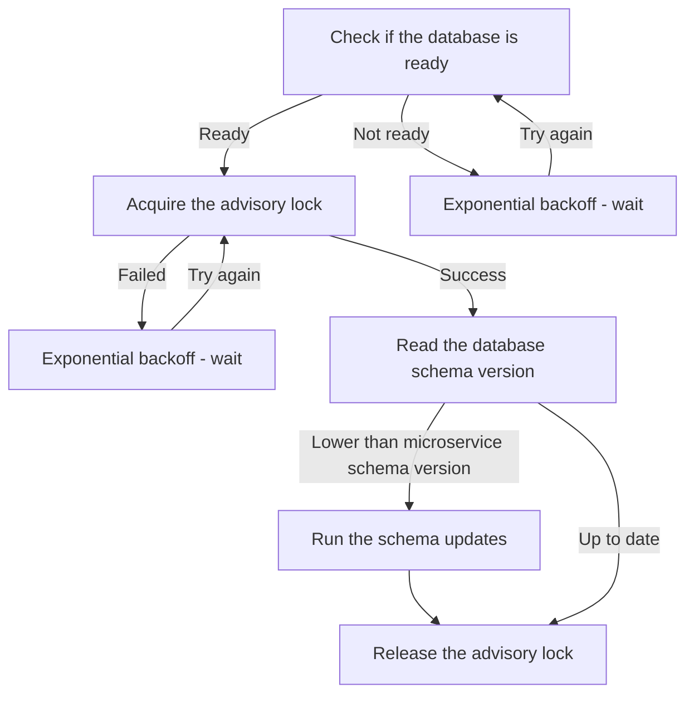

# Introduction

The PostgreSQL database is a powerful, open source, object-relational database system.
It is a fully ACID-compliant and transactional database management system with strong reputation for reliability, data integrity, and correctness.
It is also highly extensible and has many advanced features not found in other database systems.

In the Lungmuß Refractory Project, we use PostgreSQL as the main database for the system.
The database is the single source of truth for all data in the system.

# Advisory Locks

PostgreSQL provides a means for creating locks that have application-defined meanings. These are called advisory locks,
because the system does not enforce their use — it is up to the application to use them correctly. Advisory locks can be
useful for locking strategies that are an awkward fit for the MVCC model. For example, a common use of advisory locks is
to emulate pessimistic locking strategies typical of so-called “flat file” data management systems. While a flag stored
in a table could be used for the same purpose, advisory locks are faster, avoid table bloat, and are automatically
cleaned up by the server at the end of the session.

Advisory locks are created by calling the function pg_advisory_lock() with a 64-bit integer argument.
More information on Advisory Lock Functions can be found in the [PostgreSQL documentation](https://www.postgresql.org/docs/current/functions-admin.html#FUNCTIONS-ADVISORY-LOCKS).

## Schema updates

Since the same microservices are deployed as a [Kubernetes ReplicaSet](https://kubernetes.io/docs/concepts/workloads/controllers/replicaset/), we need to make sure that only one instance of the microservice is running the database schema updates at any given time.
For this, we use the PostgreSQL advisory lock with the lock identifier as specified in the table below.

The microservice must run the following steps:

The table with the lock identifiers have moved to: [subsystems](../subsystems.md)