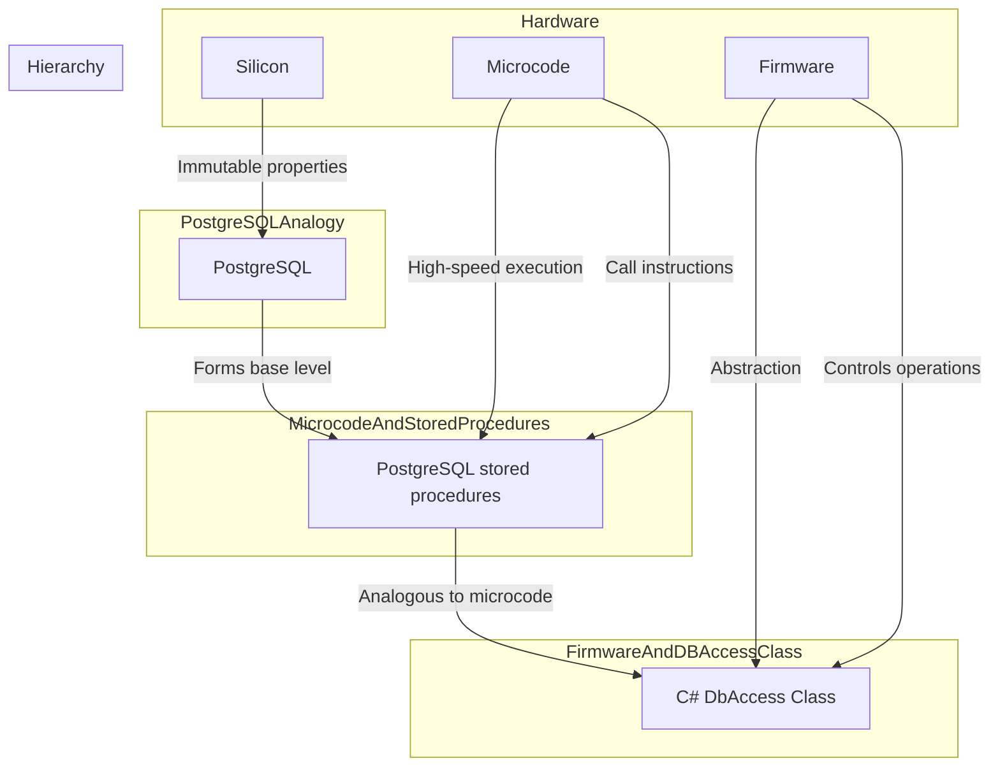

# Database vision

## Silicon, Microcode, and Firmware

* **Silicon** is the base material used in a majority of semiconductor devices and integrated circuits which are the building blocks of modern electronic devices, including computers. Silicon is used due to its abundance and its excellent properties for managing electricity.

* **Microcode** is a low-level layer of processor instructions that translates machine language into electronic signals within the processor. Different chips from different manufacturers, or even different models from the same manufacturer, might require different microcode to do the same high-level operation. Microcode can be thought of as a program for the processor itself, which it uses to interpret the machine code instructions it is given.

* **Firmware** is a type of software that provides low-level control for a device's specific hardware. It can be found inside many electronic devices including computers, cameras, and even home appliances. Firmware typically holds the routines your device uses to start up and perform basic functions. It is stored in non-volatile memory devices such as ROM, EPROM, or flash memory. Firmware can be "flashed" or updated to repair or update the functionality of the device.

As a developer, having an understanding of each of these components can provide a deeper insight into the working of computing systems, which can influence efficient coding practices and the creation of effective software solutions.

# PostgreSQL Analogy

Just like silicon forms the foundational infrastructure for all hardware functioning in a computer system, **PostgreSQL** acts as the foundational backbone for managing and organizing data in an application.

The way silicon's properties are immutable, meaning that it maintains its characteristics irrespective of the circumstances, PostgreSQL also presents its offered functionalities as constants; they cannot be changed once the system is in function.

Silicon, in its very essence, cannot transform to cater to individual specifications for hardware components; it provides a set standard of offerings around which these components are modeled. Similarly, **PostgreSQL** provides a robust set of features that are constant.

Developers build their applications' structure understanding the inherent capabilities of silicon in hardware. Likewise, in software and applications, developers incorporate their design models around the capabilities of **PostgreSQL**, utilizing its features to the maximum capacity instead of attempting to alter its inherent functionalities.

Silicon comes with a predefined set of properties which form the basis for the development of all hardware components. Similarly, **PostgreSQL** comes with a vast range of in-built functions which form the basis for complex database operations, without the need for external dependencies or alterations.

## Microcode and PostgreSQL Stored Procedures Analogy

**Microcode** is like the secret recipe that the hardware processor uses to understand and execute the instructions given to it. In a similar fashion, **PostgreSQL stored procedures** are the secret recipes used to execute complex queries, perform calculations, and manipulate data within the PostgreSQL environment.

Just as microcode operates at an incredibly high speed within the processor, stored procedures in PostgreSQL are also executed very swiftly. They are pre-compiled and readily available for execution, making data fetching and manipulation tasks remarkably fast.

Programming in microcode can be a daunting task due to its complexity and closeness to the hardware. Similarly, writing PostgreSQL stored procedures can be a challenge due to the complexity involved in dealing with intricate database operations.

Debugging at the microcode level is complicated as it involves stepping into the inner workings of the processor. The equivalent in PostgreSQL is the complex and tedious task of debugging stored procedures, owing to their close association with the database.

Microcode operates in a limited instruction set, providing core functionality to the processor. Similarly, PostgreSQL stored procedures operate with a limited set of SQL commands but they provide significant functionality in the form of complex query execution and database manipulation within PostgreSQL.

## Firmware and DB Access Class Analogy

The same way **firmware** forms an essential interface between hardware and high-level software by providing basic, low-level control on hardware components, a **DB Access Class** in C# forms the interface between the application and the database.

Firmware is designed to bring everything up to a higher level, to make it more understandable and accessible for higher-level software. In a similar vein, a DB Access Class pulls DB operations up to a higher-level, using an eloquent C# syntax.

Firmware is written using high-level programming languages, which allows it to provide a more abstract and comfortable interface for operating hardware. Similarly, a DB Access Class in C# is written in a high-level programming language, offering an abstract and more comfortable interface for executing database operations.

Just as firmware has the capability to call into the microcode to instruct the hardware to perform certain tasks, DB Access classes in C# call stored procedures to perform specific operations in a database.

A DB Access Class, much like the firmware, enables the complexity of lower-level commands to be abstracted and represented in a manner more readily understood and utilized by developers.

## Hierarchy of PostgreSQL, Stored Procedures and the C# DbAccess Class

Let's visualize the hierarchy of **PostgreSQL**, **Stored Procedures**, and the **C# DbAccess Class** as the layers of computer hardware, inspired by the analogies we discussed.

As stated, PostgreSQL is likened to Silicon, indicating that it forms the base level of our hierarchy, much like Silicon forms the foundational structure of all hardware operations.

PostgreSQL offers a robust set of features and functionalities that cannot be altered, and this unchangeable nature lies at the core of all subsequent interactions in the hierarchy, just like the immutable nature of Silicon lies at the core of all hardware operations.

The next level up is where Stored Procedures come into play, analogous to microcode. Just as microcode provides a set of low-level processor instructions enabling the translation of machine language into processor operations, Stored Procedures contain pre-compiled SQL commands, making them incredibly fast and efficient for complex queries and data manipulation tasks.

Challenges arise in both microcode and Stored Procedures programming due to their low-level nature and closeness to the hardware (PostgreSQL, in the case of Stored Procedures). Yet, despite their complexities, they form an essential layer in the hierarchy.

At the top level of our hierarchy, we have the C# DbAccess Class, equated to Firmware. Firmware interfaces between the hardware and high-level software, providing an abstract representation of low-level hardware operations. Similarly, the C# DbAccess Class serves as an interface between the application and the database (PostgreSQL). It's here that complexities are simplified, commands are finely tuned, and operations become accessible via the higher-level C# language.

Lastly, just like firmware controls hardware operations by calling into the microcode, the C# DbAccess Class in the hierarchy controls the execution of database tasks by calling the Stored Procedures.

Understanding this hierarchy can provide a clearer understanding of the separation of responsibilities, vertical control flow, as well as relationships between these elements.

As developers, it's essential to consider the long-term efficiency and stability of our software solutions.
While writing stored procedures might appear more time-intensive initially,
it offers significant advantages in terms of stability and performance.
Unlike higher-level code, stored procedures are not as volatile;
they provide a consistent and reliable foundation for data manipulation within our PostgreSQL database.
This stability is crucial for maintaining a snappy and responsive user experience,
which is a cornerstone of any successful application.

Investing in this design doesn't exclude us from using Object-Relational Mapping (ORM) tools;
instead, it complements them.
ORM tools can simplify our code and improve productivity,
but when it comes to optimizing data access speed, leveraging stored procedures is a strategic choice.
These stored procedures act as efficient,
pre-compiled routines that execute complex queries and data manipulations swiftly,
enhancing the overall performance of our application.

In conclusion, while the initial effort in writing and maintaining stored procedures may seem demanding,
the long-term benefits in terms of stability and speed optimization make it a sound investment.
This design approach, in combination with ORM tools,
ensures that our applications not only run smoothly but also deliver a snappy and responsive user experience,
which is a critical factor in user satisfaction and the success of our software projects.
